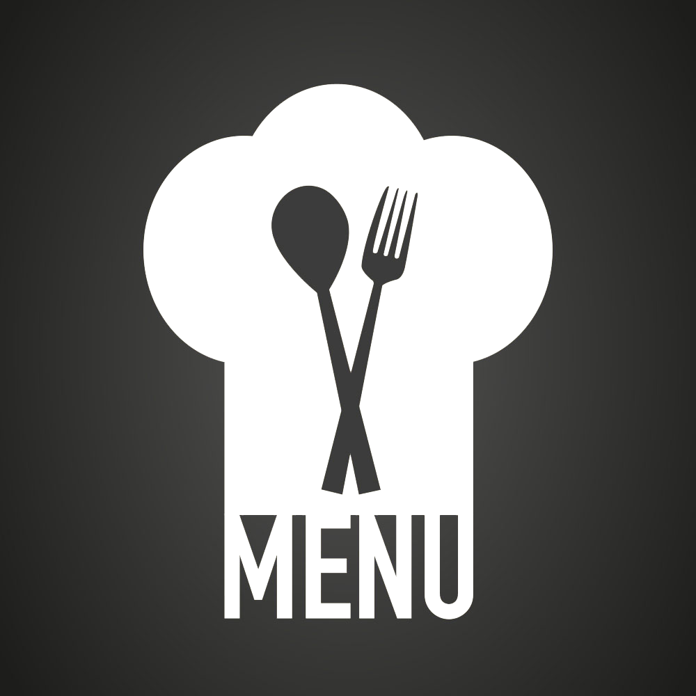

<a name="readme-top"></a>

<!--
HOW TO USE:
This is an example of how you may give instructions on setting up your project locally.

Modify this file to match your project and remove sections that don't apply.

REQUIRED SECTIONS:
- Table of Contents
- About the Project
  - Built With
  - Live Demo
- Getting Started
- Authors
- Future Features
- Contributing
- Show your support
- Acknowledgements
- License

OPTIONAL SECTIONS:
- FAQ

After you're finished please remove all the comments and instructions!
-->

<div align="center">
  <!-- You are encouraged to replace this logo with your own! Otherwise you can also remove it. -->
  
  <br/>

  <h3><b>Capstone Project</b></h3>

</div>

<!-- TABLE OF CONTENTS -->

# 📗 Table of Contents

- [📗 Table of Contents](#-table-of-contents)
- [📖  JavaScript Capstone Project ](#--javascript-capstone-project-)
  - [🛠 Built With ](#-built-with-)
    - [Tech Stack ](#tech-stack-)
    - [Key Features ](#key-features-)
  - [🚀 Video Description ](#-video-description-)
  - [💻 Getting Started ](#-getting-started-)
    - [Prerequisites](#prerequisites)
    - [Setup](#setup)
    - [Install](#install)
    - [Usage](#usage)
    - [Run tests](#run-tests)
    - [Deployment](#deployment)
  - [👥 Authors ](#-authors-)
  - [🔭 Future Features ](#-future-features-)
  - [🤝 Contributing ](#-contributing-)
  - [⭐️ Show your support ](#️-show-your-support-)
  - [🙏 Acknowledgments ](#-acknowledgments-)
  - [📝 License ](#-license-)

<!-- PROJECT DESCRIPTION -->

# 📖  JavaScript Capstone Project <a name="about-project"></a>


**JavaScript Capstone project** is a group project to that working on two API [MealAPI](https://www.themealdb.com/api.php) and [InvovlementAPI](https://www.notion.so/microverse/Involvement-API-869e60b5ad104603aa6db59e08150270)

## 🛠 Built With <a name="built-with"></a>

### Tech Stack <a name="tech-stack"></a>
<details>
  <summary>Client</summary>
  <ul>
    <li><a href="#">JavaScript</a></li>
    <li><a href="#">HTML</a></li>
    <li><a href="#">CSS</a></li>
    <li><a href="#">Webpack</a></li>
  </ul>
</details>

<!-- Features -->

### Key Features <a name="key-features"></a>
- **Work with two API**
- **Use Webpack**
- **Dynamic page content**

<p align="right">(<a href="#readme-top">back to top</a>)</p>

<!-- LIVE DEMO -->

## 🚀 Video Description <a name="video-description"></a>

- [Vidoe Description link](https://drive.google.com/file/d/1X1IQpoP5hUYZR-SxRkqmbyC4FOUQgeEh/view?usp=sharing)

<p align="right">(<a href="#readme-top">back to top</a>)</p>

<!-- GETTING STARTED -->

## 💻 Getting Started <a name="getting-started"></a>


To get a local copy up and running, follow these steps.

### Prerequisites

In order to run this project you need understand basic of the following:
  - html
  - CSS
  - JavaScript
  - Webpack

### Setup

Clone this repository to your desired folder:

```sh
git clone https://github.com/ahadb802/Capstone-project.git
cd Capstone-project
```

### Install

Install this project with:

```sh
  npm install
```

### Usage

To run the project, execute the following command:

Example command:

```sh
  npm run start
```

### Run tests

To run tests, run the following command:

```sh
  npm run test
```

### Deployment

You can deploy this project using: Github page
<p align="right">(<a href="#readme-top">back to top</a>)</p>

<!-- AUTHORS -->

## 👥 Authors <a name="authors"></a>


👤 **Birhanu Gudisa**

- GitHub: [@GutemaG](https://github.com/GutemaG)
- Twitter: [@birhanugudisa3](https://twitter.com/birhanugudisa3)
- LinkedIn: [birhanugudisa](https://linkedin.com/in/birhanugudisa)

👤 **Abdul Ahad**
- GitHub: [@ahadb802](https://github.com/ahadb802)
- Twitter: [@twitterhandle](https://twitter.com/twitterhandle)
- LinkedIn: [LinkedIn](https://linkedin.com/in/linkedinhandle)
- Gmail: [ahadb802](https://github.com/ahadb802)
- Portfolio: [Portfolio](https://ahadb802.github.io/My-Portfolio/)

<p align="right">(<a href="#readme-top">back to top</a>)</p>

<!-- FUTURE FEATURES -->

## 🔭 Future Features <a name="future-features"></a>


- [ ] **Add Reservation page**

<p align="right">(<a href="#readme-top">back to top</a>)</p>

<!-- CONTRIBUTING -->

## 🤝 Contributing <a name="contributing"></a>

Contributions, issues, and feature requests are welcome!

Feel free to check the [issues page](https://github.com/ahadb802/Capstone-project/issues).

<p align="right">(<a href="#readme-top">back to top</a>)</p>

<!-- SUPPORT -->

## ⭐️ Show your support <a name="support"></a>


If you like this project give us a star.

<p align="right">(<a href="#readme-top">back to top</a>)</p>

<!-- ACKNOWLEDGEMENTS -->

## 🙏 Acknowledgments <a name="acknowledgements"></a>

I would like to thank Microverse Community

<p align="right">(<a href="#readme-top">back to top</a>)</p>

<!-- FAQ (optional) -->

<!-- LICENSE -->

## 📝 License <a name="license"></a>

This project is [MIT](./LICENSE) licensed.
<p align="right">(<a href="#readme-top">back to top</a>)</p>
